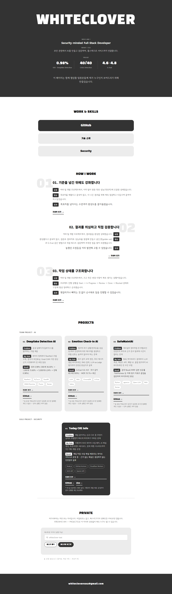
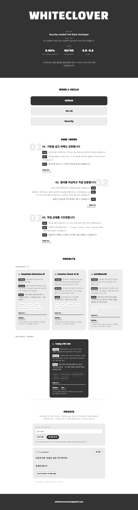
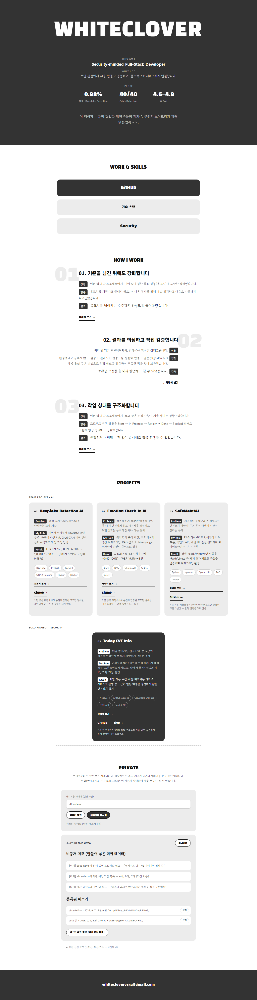

# 과제 8 제출 — 내 소개 페이지에 패스키 달기

> 제출 폼에 그대로 옮겨 붙일 수 있도록 필요한 내용을 한 파일에 모았습니다.
> 원본 문서: [ASSIGNMENT.md](ASSIGNMENT.md)(지침) · [progress.md](progress.md)(작업 기록) · [검증안내서.md](검증안내서.md) · [AI3줄.md](AI3줄.md) · [인증구현설명서.md](인증구현설명서.md)

## 제출물 URL

- **공개 결과물 주소**: https://makeportfolio-red.vercel.app
- **소스 주소**: https://github.com/whiteclover0542/portfolio

---

## 완주 체크리스트

- [x] 공개 영역과 비공개 영역을 화면에서 갈라 두었다.
- [x] 패스키를 등록했고, 서버에 저장된 것이 공개키라는 것을 보였다.
- [x] 매번 새 질문이 오고, 이미 쓴 질문은 다시 통하지 않는 것을 확인했다.
- [x] 패스키를 두 개 등록해 하나를 지운 뒤에도 들어갔다.
- [x] 남의 패스키로는 열리지 않는 것을 요청과 응답으로 남겼다.
- [x] 제출물 어디에도 실제 개인정보와 비밀값이 없다.

---

## 짧은 확인 방법 4줄

### 어디로 가나요
- https://makeportfolio-red.vercel.app

### 세 단계 안에 무엇을 하나요
1. 위 주소를 연다 — WHO AM I~PROJECTS까지는 1번 과제와 동일하게 그대로 보인다.
2. 아래로 스크롤해 PRIVATE 구역에서 아이디를 아무거나 입력하고 "패스키 등록"을 누른다 (내 기기의 생체인증/PIN 창이 뜬다).
3. 등록이 끝나면 비공개 메모·등록된 패스키 목록이 바로 열린다. "로그아웃" 후 같은 아이디로 "패스키로 로그인"을 눌러도 다시 열리는지 확인한다.

### 무엇이 보이면 통과인가요
- 로그인 전에는 PRIVATE 구역에 비공개 메모가 전혀 보이지 않는다(등록/로그인 버튼만 보임).
- 패스키 등록·로그인 성공 시 비공개 메모 3개와 등록된 패스키 목록(이름+등록일)이 열린다.
- 화면 어디에도 비밀번호를 입력하는 칸이 없다.

### 안 될 때는 무엇이 보이나요
- 브라우저·기기가 패스키(WebAuthn)를 지원하지 않으면 "이 브라우저·기기는 패스키를 지원하지 않습니다" 메시지가 뜬다.
- 등록·로그인 창을 취소하면 "취소했거나 실패했습니다" 메시지가 뜨고 화면은 잠긴 상태 그대로 유지된다. 서버에는 아무것도 저장되지 않는다.
- 화면 하단 "요청·응답 로그" 패널을 펼치면 방금 무슨 요청이 어떤 상태 코드로 응답됐는지 그대로 볼 수 있다.

---

## AI와 내 판단 3줄

- **AI에게 맡긴 일**: WebAuthn(SimpleWebAuthn) 등록·로그인 API 구현, 세션/challenge 저장소 설계(Upstash Redis + 로컬 파일 폴백), Vercel 배포·Redis(Upstash) 연동 진행, Playwright+CDP 가상 인증기로 등록/로그인/챌린지 재사용/기기 분실/교차 계정 시나리오를 자동으로 재현해 증거(스크린샷, 요청·응답 로그)를 로컬과 실제 배포 주소 양쪽에서 수집.
- **내가 직접 판단한 일**: 인증 서버를 어디에 둘지(Vercel 서버리스 + Redis 조합), 비공개 영역에 넣을 더미 데이터의 구체적 내용과 계정 모델(아이디 기반, 이메일·실명 없음), 등록 성공 시 바로 로그인 처리할지 여부, "아직 못 막은 것"으로 사용자 이름 열거(username enumeration)를 인정하기로 한 것, Vercel/GitHub 계정 로그인과 Upstash 이용약관 동의는 직접 진행, 실제 갤럭시 기기로 직접 패스키 등록해서 저장 위치(삼성패스) 확인.
- **AI 말을 따르지 않은 일**: 없음 — 제안된 구현을 그대로 채택했지만, 채택 전 매번 로컬 자동화 테스트(가상 인증기 기반 end-to-end)로 직접 재검증한 뒤에만 반영했고, 검증 스크립트가 놓친 케이스(등록 취소 시 실제로 아무것도 저장되지 않는지, 로그아웃한 쿠키 재사용 차단)는 직접 요구해서 테스트를 추가시켰다.

---

## 인증 구현 설명서

### ① 무엇으로 붙였나
라이브러리 사용. 백엔드는 `@simplewebauthn/server`(v13), 프런트엔드는 `@simplewebauthn/browser`(v13, jsdelivr CDN에 버전 고정)로 WebAuthn 등록·로그인 의식을 처리한다. 직접 구현한 부분은 challenge/세션 저장소, 계정·패스키 데이터 모델, 각 API 엔드포인트, 프런트엔드 UI(`passkey.js`)다.

실제 갤럭시 기기(삼성 인터넷/Chrome)로 배포 주소에서 직접 패스키를 등록해 확인한 결과, 패스키는 **삼성패스(Samsung Pass)**에 저장됐다 — 등록 창에서 저장 위치를 물어볼 때 "삼성패스에 로그인 정보 저장"으로 떴고, 이후 로그인도 삼성패스로 정상 통과했다.

### ② 왜 그걸 골랐나
WebAuthn 명세를 처음부터 직접 구현하면 CBOR 디코딩·서명 검증 등에서 실수하기 쉬워, 가장 널리 쓰이는 오픈소스 구현체(SimpleWebAuthn)에 검증 로직을 맡기고 저장·세션·API 설계는 직접 통제했다. 1번 과제는 GitHub Pages(정적 호스팅)였는데, challenge 발급·서명 검증을 실행할 서버가 필요해 Vercel(서버리스 함수) + Upstash Redis(공개키·세션 저장) 조합으로 옮겼다.

### ③ 어디를 어떻게 고쳤나
| 흐름 | 소스 위치 |
|---|---|
| 등록 | `api/register-options.js`(challenge 발급) → `api/register-verify.js`(서명 검증 + 공개키 저장 + 세션 발급) |
| 로그인 | `api/login-options.js`(challenge 발급) → `api/login-verify.js`(서명 검증 + 세션 발급) |
| 로그아웃 | `api/logout.js`(서버에 저장된 세션 삭제 + 쿠키 제거) |
| 비공개 자료 조회 | `api/private.js`(비공개 메모), `api/passkeys.js`(패스키 목록·삭제) — 둘 다 `api/_lib/require-session.js`를 통과해야 응답 |

프런트엔드는 `index.html`의 `#private-zone` 섹션 + `passkey.js`. 저장소 어댑터는 `api/_lib/store.js`(배포 환경은 Upstash Redis, 로컬 개발은 파일로 자동 전환).

신원 판별의 핵심 지점 — 비공개 엔드포인트는 요청의 쿼리나 바디에 담긴 username을 절대 신뢰하지 않고, 오직 세션 쿠키에서 얻은 값만 사용한다.
- `api/private.js:10-13`
- `api/passkeys.js:8-9`

### ④ 안 열리는 것을 확인한 기록
로컬(`과제8/evidence/`)과 실제 배포 주소(`과제8/evidence-prod/`) 양쪽에서 Playwright + Chrome DevTools Protocol의 가상 WebAuthn 인증기로 실제 등록·로그인 의식을 수행해 아래 네 가지를 전부 확인했다. 전체 요청/응답 원문은 [evidence-prod/log.md](evidence-prod/log.md) 참고.

1. **로그인 없이 열기** — `GET /api/private` (쿠키 없음) → **401** `{"error":"로그인이 필요합니다 (패스키 인증 필요)."}`. 로그인 성공 시에는 동일 엔드포인트가 **200**과 함께 메모 3개를 반환.
2. **남의 패스키로 열기** — alice의 credential id로 `bob-demo` 계정에 로그인 시도 → **401** `{"error":"이 계정에 등록된 패스키가 아닙니다."}`. 반대 방향(bob → alice)도 동일하게 **401**. 정상적인 자기 계정 로그인은 **200** `{"ok":true,"username":"alice-demo"}`.
3. **이미 쓴 질문 재사용** — 방금 성공 처리된 `POST /api/login-verify` 요청 바디를 그대로 재전송 → **401** `{"error":"로그인용 질문이 없거나 이미 사용됨(또는 만료됨)."}`. 로그아웃한 옛 세션 쿠키로 `/api/private`를 다시 요청해도 동일하게 **401**.
4. **패스키 삭제 뒤 로그인** — 패스키 2개(alice-노트북, alice-폰) 등록 후 alice-노트북 삭제 → 남은 alice-폰으로 로그인 **성공**(200). 삭제된 alice-노트북의 credential id로 로그인 시도 → **401** `{"error":"이 계정에 등록된 패스키가 아닙니다."}`.

추가로 확인한 것: 로그인한 alice 세션 상태에서 쿼리스트링(`?username=bob-demo`)이나 커스텀 헤더로 다른 계정을 지정해도 `/api/private` 응답은 항상 alice 자신의 메모 3개만 반환됐다(개수·내용 모두 alice 고유 값과 동일, bob의 자료가 섞여 나오지 않음).

### ⑤ AI와 나
위 "AI와 내 판단 3줄"과 동일.

### ⑥ 아직 못 막은 것
`api/login-options.js`가 존재하지 않는 계정에는 404, 존재하는 계정에는 200을 돌려주기 때문에, 외부에서 아이디가 등록되어 있는지 여부를 구분(사용자 이름 열거, username enumeration)할 수 있다. 로그인 시도 횟수에 대한 rate limit도 없어서 이 열거를 자동화로 반복하는 것 역시 막혀 있지 않다. 실제 서비스라면 존재 여부와 무관하게 항상 같은 형태의 응답을 돌려주고 IP/계정 단위 rate limit을 추가해야 한다.

부가적으로: 플랫폼 인증기(Windows Hello, Touch ID 등) 다수가 counter 값을 항상 0으로 보고하기 때문에, 코드에 넣어둔 counter 기반 복제 인증기 탐지(`api/login-verify.js`의 카운터 비교 로직)는 이런 인증기에서는 사실상 동작하지 않는다.

---

## 작업 내용 (카드별)

### 카드 1 — 무엇을 잠글지 먼저 가른다
1번 과제 페이지는 그대로 두고, PRIVATE 섹션을 새로 추가했다. 로그인 전에는 화면·HTML 소스 어디에도 비공개 내용이 없고, `/api/private`를 직접 요청해도 401로 거절된다.

### 카드 2 — 패스키를 등록한다
서버가 challenge를 만들어 보관하고(요청마다 다른 값), 브라우저가 `navigator.credentials.create()`로 만든 공개키만 서버에 저장한다. 개인키는 등록 요청 본문에 전혀 없다. 등록에 성공하면 그 자리에서 바로 로그인 처리되고, 실패(위조·취소)하면 아무것도 저장되지 않는다. 실제 기기로는 삼성패스에 저장됨을 확인했다.

### 카드 3 — 패스키로 들어간다
로그인도 매번 새 challenge를 받아 서명하고, 서버는 저장된 공개키로 검증한다. challenge는 읽는 즉시 삭제해 같은 값으로 재요청하면 거절되고, 로그아웃한 세션 쿠키를 재사용해도 거절된다.

### 카드 4 — 기기를 잃어버렸을 때
한 계정에 패스키를 2개(노트북·폰) 등록했다. 하나를 지워도 남은 패스키로 로그인할 수 있고, 지운 패스키의 credential id로는 더 이상 로그인할 수 없다.

### 카드 5 — 정말 안 열리는지 확인 + 문서화
계정 2개(alice/bob)를 만들어 서로의 패스키로 서로의 계정에 로그인을 시도해 양방향 모두 거절됨을 확인했다. 로그인 상태에서 쿼리·헤더로 다른 계정을 지정해도 항상 자기 자료만 돌아온다. 이 문서, `검증안내서.md`, `AI3줄.md`, `인증구현설명서.md`로 정리했다.

---

## 카드별 통과 기준 체크리스트 (T08-C01 ~ T08-C53)

### 카드 1 — 공개/비공개 분리
- [x] T08-C13 공개 영역과 비공개 영역이 화면에서 구분되어 보인다
- [x] T08-C14 비공개 영역에 들어 있는 항목이 세 개 이상이다
- [x] T08-C15 패스키로 들어가지 않은 상태에서는 비공개 영역의 내용이 화면에 보이지 않는다
- [x] T08-C16 패스키로 들어가지 않은 상태에서 비공개 자료를 서버에 직접 요청하면 거절된다
- [x] T08-C17 그 거절이 401 또는 403으로 이뤄진다
- [x] T08-C18 로그인하지 않은 상태로 받은 페이지의 소스 어디에도 비공개 내용이 들어 있지 않다

### 카드 2 — 패스키 등록
- [x] T08-C19 서버가 등록용 challenge를 만들어 보내고, 확인할 때까지 보관한다
- [x] T08-C20 등록 요청마다 질문 값이 서로 다르다는 기록이 있다
- [x] T08-C21 등록이 끝나면 서버에 공개키가 저장된다
- [x] T08-C22 저장된 값이 공개키이며 비밀번호가 아니라는 설명이 있다
- [x] T08-C23 개인키가 서버로 전송되지 않는다는 것이 등록 요청 본문 기록으로 확인된다
- [x] T08-C24 등록한 패스키에 사람이 알아볼 수 있는 이름이 붙는다
- [x] T08-C25 등록을 중간에 취소하면 안내가 나오고 서버에 아무것도 저장되지 않는다
- [x] T08-C26 패스키를 저장한 곳이 적혀 있다 — 삼성패스(Samsung Pass), 실제 갤럭시 기기로 확인

### 카드 3 — 패스키 로그인
- [x] T08-C27 로그인할 때도 서버가 매번 새 질문을 만들어 보낸다
- [x] T08-C28 로그인 요청마다 질문 값이 서로 다르다는 기록이 있다
- [x] T08-C29 저장된 공개키로 서명을 확인한 뒤에만 통과시킨다
- [x] T08-C30 성공한 요청과 실패한 요청이 나란히 적혀 있다
- [x] T08-C31 이미 쓴 질문 재사용 요청과 거절 응답이 적혀 있다
- [x] T08-C32 로그인 뒤 세션·토큰 중 무엇으로 식별하는지 적혀 있다 — httpOnly 세션 쿠키
- [x] T08-C33 로그아웃 후 같은 값으로 재요청 시 거절 응답이 적혀 있다
- [x] T08-C34 기록에서 세션·토큰 값이 가려져 있다
- [x] T08-C35 제출물 어디에도 비밀번호 입력 칸이 없다

### 카드 4 — 기기 분실 대비
- [x] T08-C42 한 계정에 패스키가 두 개 등록되어 있다
- [x] T08-C43 패스키 목록에서 이름·등록일이 보인다
- [x] T08-C44 하나 지운 뒤 남은 하나로 들어갈 수 있다
- [x] T08-C45 지운 패스키로는 더 이상 들어갈 수 없다는 기록이 있다
- [x] T08-C46 패스키가 하나도 안 남았을 때 어떻게 되는지 화면·제출문에 적혀 있다

### 카드 5 — 교차 검증 + 설명서
- [x] T08-C01 결과물 URL 필드에 HTTPS URL 1개
- [x] T08-C02 소스 URL 필드에 HTTPS URL 1개
- [x] T08-C03 모든 URL이 새 시크릿 창에서 계정 생성/로그인/인증/초대/비밀번호/OAuth/CAPTCHA 없이 열린다
- [x] T08-C10 결과물 첫 화면이 공개 소개 페이지, 등록 없이 열린다
- [x] T08-C11 1번 과제 페이지에 이어 붙였고 공개 내용이 그대로 남아 있다
- [x] T08-C12 실제 개인정보 없음, 더미 데이터라는 사실이 적혀 있다
- [x] T08-C36 계정 2개, 각각 다른 비공개 내용
- [x] T08-C37 한쪽→다른쪽 접근 시도 + 거절 응답
- [x] T08-C38 반대 방향도 거절 기록
- [x] T08-C39 거절 앞뒤로 상대 자료 건수 동일 기록
- [x] T08-C40 요청에 다른 계정 지정해도 내 자료만 돌아옴
- [x] T08-C41 거절을 만드는 소스 위치 명시
- [x] T08-C47 설명서 6항목 각각 분리되어 있다
- [x] T08-C48 ①에 구현 방식·이름 명시
- [x] T08-C49 ③에 4개 흐름의 소스 위치 명시
- [x] T08-C50 ④에 4가지 확인 각각 성공/거절 나란히
- [x] T08-C51 ⑥에 못 막은 것 최소 1개 구체적으로
- [x] T08-C52 짧은 확인 방법 4줄 각각 분리
- [x] T08-C53 AI 3줄 각각 분리

---

## 스크린샷 (실제 배포 주소에서 자동 검증 중 촬영)

### 1. 로그인 전 — 공개/비공개 경계

### 2. 패스키 등록 성공 → 비공개 메모 열림

### 3. 패스키 2개 등록된 목록

### 4. 패스키 하나 삭제 후

전체 요청·응답 원문 로그: [evidence-prod/log.md](evidence-prod/log.md)
